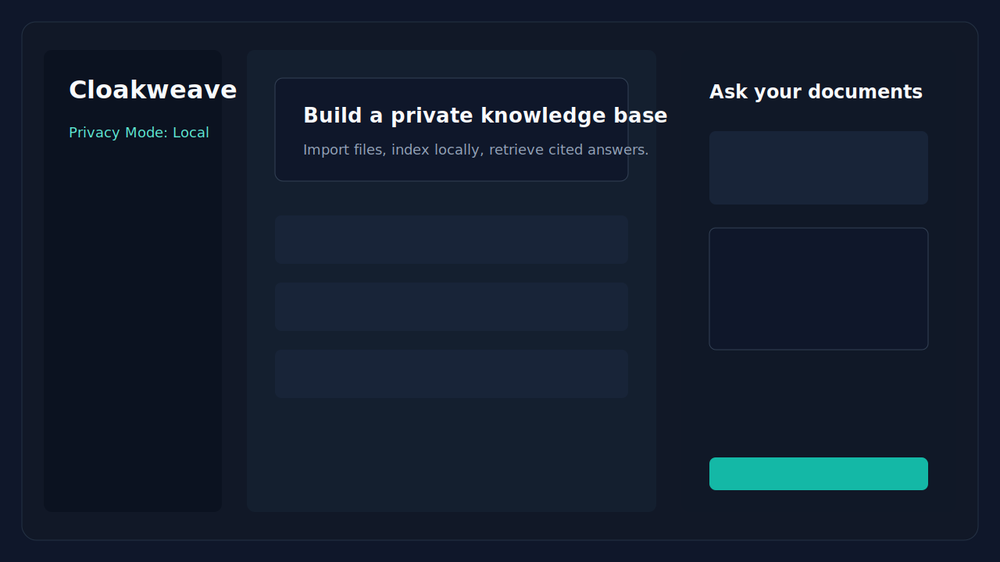

# Cloakweave

Build a private AI knowledge base from your own files.




Cloakweave is a local-first desktop RAG builder that lets you import documents, create a private searchable index, and ask questions with cited answers. Your files stay on your machine by default.

Most document chat tools ask you to upload private files to someone else's server. Cloakweave gives you a local-first alternative: index your own documents, search them semantically, and generate answers with citations using a local model provider such as Ollama.

## What is Cloakweave?

Cloakweave is an open source desktop app for building private document knowledge bases. It runs as an Electron app with a React and TypeScript interface, stores workspace data locally, and uses a local baseline embedding provider for search.

The current app supports workspace creation, file import, text extraction, chunking, local embeddings, SQLite-backed persistence, semantic search, retrieval-only Q&A, and optional Ollama answer generation.

## Why Cloakweave?

Cloakweave is for developers, researchers, students, founders, and privacy-conscious teams who want useful document search without making cloud upload the default path.

It is not trying to be a massive enterprise RAG platform. The goal is a simple local-first app that is easy to run, easy to inspect, and practical enough to build on.

## Features

- Local-first document indexing
- Private workspace-based knowledge bases
- Drag-and-drop file import
- Native file picker import
- Semantic search across your documents
- Question answering with source citations
- Retrieval-only mode when no LLM is configured
- Optional Ollama support for local answer generation
- SQLite-backed local storage through `sql.js`
- Cross-platform desktop app for macOS, Windows, and Linux
- No telemetry by default

## Privacy-first by default

Cloakweave is designed around a simple rule: your files should stay yours.

By default:

- Documents are read from your local machine.
- Extracted text is stored in your local workspace.
- Embeddings are generated locally.
- The search index is stored locally.
- No telemetry is enabled.
- No cloud LLM is required.

Cloud providers should only be used if you explicitly configure them. If you enable a cloud provider, review that provider's data policy before sending private document content.

## Quick start

```bash
git clone https://github.com/hadnan1994/cloakweave.git
cd cloakweave
npm install
npm run dev
```

Run tests:

```bash
npm test
```

Run typecheck:

```bash
npm run typecheck
```

Build:

```bash
npm run build
```

## Using Ollama for local answers

Cloakweave can use Ollama for local answer generation.

Install Ollama, start it, and pull a model:

```bash
ollama pull llama3.1
```

Then open Cloakweave settings and use:

```txt
Endpoint: http://localhost:11434
Model: llama3.1
```

If Ollama is not running, Cloakweave still works in retrieval-only mode.

## Retrieval-only mode

You do not need an LLM to use Cloakweave.

When no model provider is configured or Ollama is unavailable, Cloakweave can still retrieve the most relevant document snippets for your question. This is useful for private search, research, and source discovery.

## Supported files

Current MVP support:

- `.txt`
- `.md`
- `.json`
- `.csv`

PDF extraction is not enabled yet. PDF imports fail gracefully with a clear unsupported-file message until a reliable local parser is added.

## How it works

Cloakweave follows a simple local RAG pipeline:

1. Import files into a workspace.
2. Extract text from supported files.
3. Split text into overlapping chunks.
4. Generate deterministic local baseline embeddings.
5. Store files, chunks, and embeddings in SQLite.
6. Retrieve relevant chunks for a question.
7. Generate an answer with citations if Ollama is available.
8. Fall back to retrieved source snippets when no LLM is available.

## Architecture

```txt
Files
  -> Text extraction
  -> Chunking
  -> Local embeddings
  -> SQLite workspace index
  -> Semantic retrieval
  -> Cited answer generation
```

Core modules:

- `fileExtract.ts` handles text extraction.
- `chunking.ts` splits text into searchable chunks.
- `embeddings.ts` generates and compares vectors.
- `rag.ts` handles retrieval and prompt construction.
- `ollama.ts` handles optional local model generation.
- `workspace.ts` manages local workspaces.
- `sqlite.ts` manages local persistence.
- `indexing.ts` runs the import and indexing pipeline.
- `privacy.ts` centralizes local-first privacy defaults.

## SQLite persistence

Cloakweave uses `sql.js` for the initial local SQLite layer. It is SQLite compiled to WebAssembly, which avoids native Electron rebuild complexity across macOS, Windows, and Linux. Workspace databases are stored as local `cloakweave.db` files under `.cloakweave/`.

## App branding and icons

The Electron window and packaging config use `assets/cloakweavelogo.png` as the application logo source. Linux builds can use the PNG directly. Some macOS and Windows packaging targets may require platform-native `.icns` or `.ico` files for final distribution; add those derived assets before publishing signed installers if Electron Builder reports a platform-specific icon requirement.

## Development

Install dependencies:

```bash
npm install
```

Start the app:

```bash
npm run dev
```

Run tests:

```bash
npm test
```

Run typecheck:

```bash
npm run typecheck
```

Build:

```bash
npm run build
```

## Testing

The test suite covers privacy defaults, workspace creation, SQLite initialization, text extraction, deterministic chunking, local embeddings, indexing, semantic retrieval, RAG prompt construction, and Ollama fallback behavior.

```bash
npm test
```

## Roadmap

- Better PDF extraction
- DOCX support
- Website import
- GitHub repository import
- Hybrid keyword and vector search
- Local reranking
- Encrypted workspace option
- Workspace export/import
- CLI mode
- More local model providers

## Contributing

Contributions are welcome.

Good first areas:

- File parser improvements
- UI polish
- Local model integrations
- Retrieval quality improvements
- Tests
- Documentation

Please see `CONTRIBUTING.md` for development notes.

## Security

Please see `SECURITY.md` for vulnerability reporting and privacy notes.

Cloakweave handles local files, so avoid indexing files you do not trust. Cloud model providers should only be enabled intentionally.

## License

Cloakweave is open source under the MIT License. See `LICENSE`.

## Creator

Created by Hunmble Adnan.
